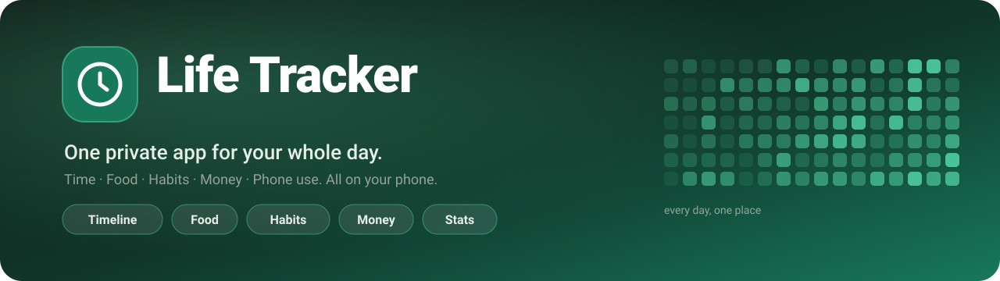
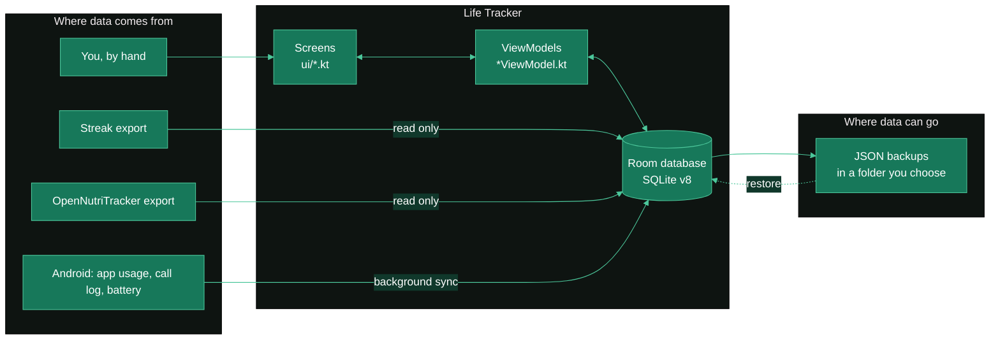
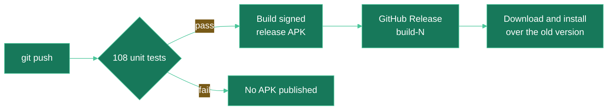

<a id="readme-top"></a>

<div align="center">



<br>

**What you did, what you ate, which habits you kept, where your money went, and where your phone time disappeared.**<br>
One Android app. Zero accounts. Zero servers. Every byte stays on your phone.

<br>


<!--
  LIVE BADGES: these only work while the repo is PUBLIC (shields.io cannot read a private repo).
  If you ever make it public, replace YOUR_USERNAME and move these up into the row above.

  [](https://github.com/YOUR_USERNAME/Life-Tracker/actions)
  [](https://github.com/YOUR_USERNAME/Life-Tracker/releases/latest)
  [](https://github.com/YOUR_USERNAME/Life-Tracker/releases)
-->

<br>

[**Why**](#-why-this-exists) &nbsp;·&nbsp;
[**Features**](#-what-it-does) &nbsp;·&nbsp;
[**Privacy**](#-privacy-by-construction) &nbsp;·&nbsp;
[**Status**](#-where-the-project-stands-today) &nbsp;·&nbsp;
[**Install**](#-install) &nbsp;·&nbsp;
[**Architecture**](#-how-it-fits-together) &nbsp;·&nbsp;
[**Roadmap**](#-roadmap) &nbsp;·&nbsp;
[**Rules**](#-rules-the-project-lives-by)

</div>

<br>

## 🧭 Why this exists

Most life-tracking apps do one thing well and ignore the rest, so a normal day ends up scattered across five apps, five accounts and five companies' servers. Life Tracker is built for **one person: its owner**. It pulls the useful ideas from the apps below into a single place, keeps the data on the device, and aims at the one thing none of them offer: **statistics you shape yourself**.

| You want | Learned from | Life Tracker's answer |
| :-- | :-- | :-- |
| A timeline of your day, with your own activities like *hours studied* | LifeXP | 🕒 **Timeline** tab |
| Meals, calories, macros and water | OpenNutriTracker | 🍽️ **Food** tab, with automatic import |
| Habits, streaks and totals | Streak | ✅ **Habits** tab, with automatic import |
| Income and spending | *(new)* | 💸 **Money** tab |
| Deep, customisable statistics on everything | Simkl | 📊 **Stats** tab *(next big milestone)* |

It also tracks what your phone already knows: **which apps you used, who you called, and when you charged**, and puts all of it on the same timeline as everything else.

<div align="right"><a href="#readme-top">↑ back to top</a></div>

---

## ✨ What it does

<table>
<tr>
<td width="50%" valign="top">

### 🕒 Timeline
Your day as a scrollable strip (60 days back, 30 ahead), with a dot under every day that has entries.

- **Log** an activity with start, end and note, or a single moment with no end time
- Make a new activity on the spot with **+ New**
- Daily summary: tracked time, entry count, goals met
- A progress bar for every activity that has a goal
- Meals, focus sessions, to-dos, notes, app use, calls and charging all land here too

</td>
<td width="50%" valign="top">

### 🎯 Your own activities & goals
Eight starter activities (Sleep, Food, Study, Health, Routine, Exercise, Screen and leisure, Life event), and then it is all yours.

- Pick names, colours (16-colour palette) and goals
- Goals go **both ways**: *at least* 8 h of study, or *at most* 2 h of screen time
- A limit bar turns **red** when you go over
- Hide an activity from the Log pop-up without touching old entries

</td>
</tr>
<tr>
<td width="50%" valign="top">

### ✅ Habits
Imported from **Streak**, tickable in the app.

- Current streak, best streak and totals per habit
- A 14-day row you tap to tick a day
- Handles yes/no habits, counted habits (one step per tap) and "relapse" habits
- Focus sessions become Timeline entries, to-dos and notes appear on their day

</td>
<td width="50%" valign="top">

### 🍽️ Food
Imported from **OpenNutriTracker**, loggable in the app.

- Calories, carbs, fat and protein against that day's goals
- Meals grouped as breakfast, lunch, dinner, snack
- **Add meal** with an *Eat again* row of past meals
- Water tracking: `+250 ml`, `+500 ml`, Undo, against a 3000 ml target

</td>
</tr>
<tr>
<td width="50%" valign="top">

### 💸 Money
Entered by hand. Adding starts with *Expense or Income?* and then *what kind?*

- **Every month**: rent, EMI, salary. Posted automatically on its day (on the last day of short months), never twice
- **Again and again**: chai, a bus ticket. Becomes a one-tap button; long-press to change the amount
- **Just once**: a book, a repair, a gift
- Your own categories, monthly in / out / left, rupees by default

</td>
<td width="50%" valign="top">

### 📱 Phone usage · 📞 Calls · 🔌 Charging
The phone's own records, copied into your database before Android forgets them.

- **App sessions** as Timeline blocks, per-app totals, app-to-activity links (Anki → Study, YouTube → Screen) so they count toward goals
- **Call log** with count, talk time and top people
- **Charging sessions** with level, speed and a *"What are you charging with?"* banner that learns to guess

</td>
</tr>
</table>

<details>
<summary><b>🔍 The details behind each feature</b> (import rules, edge cases, honest limits)</summary>

<br>

**Streak import**
- Finds the newest backup in your Streak folder on app open and merges it.
- Importing twice never doubles anything: per habit day the **higher count is kept**, and a to-do you ticked stays ticked.
- Focus sessions are split at midnight when needed. Each is brought in once; **if you delete one, it stays deleted**.
- Dated to-dos show on their day (including future days), at their time and estimated length. Undated to-dos are imported but not shown yet.
- Streak's weekly, monthly and "every X days" schedules are stored but **not applied yet**, so every streak is counted as a daily one.

**OpenNutriTracker import**
- Brings in meals, daily calorie and macro goals, and activities (walking, custom ones like a "stool" log) as Timeline entries under Health or Exercise.
- **Amounts are grams.** OpenNutriTracker counts every amount as grams even when it says "serving", and its daily totals match this app's to the calorie.
- OpenNutriTracker does not export water, so water starts at zero.

**Nothing in Streak or OpenNutriTracker is ever modified.** The app only reads those folders.

**Phone usage**
- Reads Android's own usage record (the source Digital Wellbeing uses) once you switch on *Usage access*.
- Android keeps only about a week of detail, so a background job copies it into the app's database **every 6 hours**.
- You can hide apps, leave short stretches off the Timeline, or turn app use off the Timeline entirely.
- The Phone usage screen can only show days the app has already copied.

**Calls**
- Copies the call log (who, when, how long, incoming / outgoing / missed / declined) once you allow *Call logs*. Contacts access is optional and only turns numbers into names.
- Only normal phone calls are in Android's call log, so **WhatsApp and Telegram calls do not appear**.
- The first copy reads the whole log; *Copy older calls* repeats that on demand.
- Pick any range: Today to All time, any From / To dates, or one day.

**Charging**
- Records every charger session: start and end, battery level at both ends, plug type (charger / USB / wireless) and average speed (watts, from Android's battery readings).
- Android cannot tell a power bank from a wall charger, so the app asks. After **at least 3 similar tagged sessions with 70 % agreement** it suggests an answer, shown as *(guess)*.
- It also shows how long you used the phone while it charged.
- Nothing runs while the phone is not charging. A small Android job fires about **every 15 minutes, only while charging**, so a session's end can be up to 15 minutes early.

> [!TIP]
> On **Xiaomi / HyperOS**, allow *Autostart*, set battery saver to *No restrictions* and allow pop-up notifications, or the charging banner may not appear.

**History only grows.** Phone usage, calls and charging are append-only: syncing adds rows, and restoring a backup adds to what is already there. The app never deletes anything copied from the phone.

</details>

<div align="right"><a href="#readme-top">↑ back to top</a></div>

---

## 🔒 Privacy by construction

This is not a promise in a policy page. It is what the code and the manifest actually do.

| Claim | Why it is true |
| :-- | :-- |
| **It cannot go online** | The app declares **no `INTERNET` permission** and the code contains no networking library. There is nothing to leak *to*. |
| **Your data is yours** | One private SQLite database that no other app can read. |
| **Imports only read** | Streak and OpenNutriTracker folders are never written to. |
| **Backups are plain JSON** | Open, copy or keep them in any text editor. They survive an uninstall. |
| **No account, no tracking, no ads** | There is no server to have an account on. |

<details>
<summary><b>🔑 Every permission, and exactly why it is there</b></summary>

<br>

| Permission | Why | Required? |
| :-- | :-- | :-- |
| `PACKAGE_USAGE_STATS` | Which app was on screen and for how long (switched on once in Android's settings) | Only for Phone usage |
| `READ_CALL_LOG` | Who, when and how long for the Calls screen | Only for Calls |
| `READ_CONTACTS` | Turns phone numbers into names | Optional |
| `QUERY_ALL_PACKAGES` | Looks up the display names of apps seen in the usage history | Only for Phone usage |
| `POST_NOTIFICATIONS` | The *"What are you charging with?"* banner | Optional, you can say no |

</details>

<details>
<summary><b>🛟 How backups and restore stay safe</b></summary>

<br>

- **Automatic:** one backup the first time you open the app each day, keeping the newest **5**. Then new Streak / OpenNutriTracker exports are imported.
- **Manual:** *Back up now* and *Restore* on the Data sources screen, with a backup folder you choose once (Android remembers it).
- **Atomic writes:** each file is written under a temporary name and renamed only when complete, so a crash never leaves a broken backup.
- **Cautious restore:** the file is validated before anything is touched, and your current data is saved as a **safety copy first** (newest 3 kept).
- **Format 8**, readable back to format 1.

> [!WARNING]
> Backups live on the phone, so they cannot help if the phone is lost. Copy the backup folder somewhere else now and then. Backups also contain call numbers and names **as plain text**, so keep that folder private.

</details>

<div align="right"><a href="#readme-top">↑ back to top</a></div>

---

## 📍 Where the project stands today

<div align="center">

| 📦 Version | 🗄️ Database | 🧪 Tests | 🧱 Code | 🧩 Screens |
| :-: | :-: | :-: | :-: | :-: |
| **0.9.x** | **v8**, 7 migrations, 19 tables | **108** unit tests | ~**10,000** lines of Kotlin in 68 files | **5** tabs + 5 settings screens |

</div>

**Done: Steps 1 to 10.** The foundation, five tabs, and every data source built so far.

| Area | State |
| :-- | :-- |
| 🧱 App skeleton, light + dark theme, launcher icon | ✅ Done |
| ☁️ Cloud build that publishes a signed APK on every push | ✅ Done |
| 🕒 Timeline on a real on-phone database | ✅ Done |
| 🗂️ Data sources, backups, restore, daily auto backup | ✅ Done |
| ✅ Habits + Streak import (focus sessions, to-dos, notes) | ✅ Done |
| 🍽️ Food + OpenNutriTracker import, water, meal logging | ✅ Done |
| 🎯 Custom activities, colours and daily goals | ✅ Done |
| 💸 Money: income, spending, monthly items, quick-log items, categories | ✅ Done |
| 📱 Phone usage: sessions, per-app totals, app-to-activity links | ✅ Done |
| 📞 Calls from the call log, on the Timeline, any date range | 🟡 Built and unit-tested, **not yet field-tested on a phone** |
| 🔌 Charging sessions, banner, learned guess, phone use while charging | 🟡 Built and unit-tested, **not yet field-tested on a phone** |
| 📊 Stats | 🚧 Placeholder screen |

> [!NOTE]
> The pure logic (streaks, calorie maths, usage sessions, charging rules, money planner, backup codec, importers) is covered by unit tests that **run before every release build**. If a test fails, no APK is published. Screens and background behaviour on real hardware are tested by hand, which is why Calls and Charging carry the 🟡.

<details>
<summary><b>🧬 Database evolution</b> (seven migrations, zero data lost)</summary>

<br>

Every schema change ships with a real `Migration`. Wiping and rebuilding the database is never allowed, and the build file says so.

| Version | Step | What changed | Backup format |
| :-: | :-- | :-- | :-: |
| 1 | 2 | Timeline entries | 1 |
| 2 | 4 | Habits, completions, categories, to-dos, notes, import records | 2 |
| 3 | 5 | Meals, food goals, water | 3 |
| 4 | 6 | Activity types: fixed categories became your own list | 4 |
| 5 | 7 | Money categories, saved items and entries | 5 |
| 6 | 8 | Phone usage sessions and per-app settings | 6 |
| 7 | 9 | Calls | 7 |
| 8 | 10 | Charging sessions | 8 |

</details>

<div align="right"><a href="#readme-top">↑ back to top</a></div>

---

## 🗺️ Roadmap

Each step is small enough to **build, install and try** before the next begins. The order is a plan, not a promise, and it can change at any time.


<sub>🟢 done &nbsp;·&nbsp; 🟡 next &nbsp;·&nbsp; ⚪ planned</sub>

- [x] **1 · Skeleton**: five tabs, light and dark theme, icon, cloud build
- [x] **2 · Timeline and database**: Room database, Log button, day strip, goal bar
- [x] **3 · Data sources and backups**: three folders chosen once, Back up now, Restore, daily auto backup
- [x] **4 · Habits**: Streak import, streaks, 14-day rows
- [x] **5 · Food**: OpenNutriTracker import, macros, water, meal logging
- [x] **6 · Your own activities and goals**: names, colours, minimum or limit goals
- [x] **7 · Money**: monthly, recurring and one-off entries, categories
- [x] **8 · Phone usage**: app sessions on the Timeline, links to activities
- [x] **9 · Calls**: call log on the Timeline, totals, people, any date range *(9b added any-date picking to Calls and Phone usage)*
- [x] **10 · Charging**: sessions, plug-in banner, learned guess, phone use while charging
- [ ] **11 · Steps and sleep** 👈 *next*: Health Connect steps (phone counter as fallback); sleep from Health Connect or estimated from the long night gap, with manual correction
- [ ] **12 · Places**: Home, Library, Gym with a radius, via Android geofencing (no GPS running), plus a battery and auto-start checklist for Xiaomi phones
- [ ] **13 · Trips**: walk, run, cycle or vehicle from Android's activity recognition, joined with places: *"Home to Library, vehicle, 25 minutes"*
- [ ] **14 · Life events, month and year views**: mark moments that changed your life (a new city, a new exam prep) and look back at what you did around them
- [ ] **15 · Stats**: pick any metric, view by day / week / month / year, with a heatmap and short written insights. It comes late on purpose: it needs the other steps' data first
- [ ] **16 · Polish**: reminders, search, smoother screens, and whatever daily use turns up

> [!IMPORTANT]
> **Battery is a design constraint, not an afterthought.** The upcoming steps are ordered so nothing needs an always-on notification or a constantly running service. Each one uses Android's own low-power services: Health Connect, geofencing and activity recognition.

<div align="right"><a href="#readme-top">↑ back to top</a></div>

---

## 📲 Install

No computer needed.

1. Open this repository's **Releases** page in your phone browser.
2. Download `life-tracker.apk` from the newest release.
3. Tap the file. Android asks once to allow installs from your browser or Files app. Allow it.
4. Play Protect may warn that the app is from outside the Play Store. That is expected for your own app.

A new version installs **over the old one and keeps your data**.

<details>
<summary><b>🔄 Auto-updates with Obtainium</b> (once the repo is public)</summary>

<br>

[Obtainium](https://github.com/ImranR98/Obtainium) installs and updates apps straight from GitHub Releases. This project publishes a single APK per release, which is what Obtainium expects.

1. Install Obtainium.
2. Tap **Add App** and paste `https://github.com/YOUR_USERNAME/Life-Tracker`.

Or tap this on the phone that has Obtainium: [**Add to Obtainium**](https://apps.obtainium.imranr.dev/redirect.html?r=obtainium://add/https://github.com/YOUR_USERNAME/Life-Tracker)

GitHub cannot render the raw `obtainium://` scheme as a clickable link, which is why the link above goes through a small redirect page.

> This only works for a **public** repository. See the signing-key note below before making it public.

</details>

<div align="right"><a href="#readme-top">↑ back to top</a></div>

---

## 🧩 How it fits together

Three layers, and every file belongs to exactly one of them. That is what makes the code easy to find and safe to change.



| Layer | Job |
| :-- | :-- |
| **Screens** | Only draw things and report taps. |
| **ViewModels** | Hold the current state (which day is selected, adding, deleting) and talk to the database. |
| **Database** | The one and only place that stores anything. |

### 🛠️ Tech stack

| | |
| :-- | :-- |
| **Language** | Kotlin 2.0.21, JVM 17 |
| **UI** | Jetpack Compose (BOM 2024.12.01), Material 3, light and dark themes |
| **Storage** | Room 2.6.1 over SQLite, with KSP |
| **Background work** | WorkManager 2.9.1 (usage sync every 6 h, charging check every 15 min while charging) |
| **Files** | `DocumentFile` and Android's folder picker, so no broad storage permission |
| **Build** | Android Gradle Plugin 8.7.3, Gradle 8.10.2, `compileSdk` / `targetSdk` 35, `minSdk` 26 |
| **Tests** | JUnit 4 and `org.json`, run on the JVM with no emulator |

<details>
<summary><b>🌳 Project structure</b></summary>

<br>

```
Life-Tracker/
├── README.md
├── settings.gradle.kts · build.gradle.kts · gradle.properties · .gitignore
├── docs/assets/banner.svg                 README banner
├── .github/workflows/build.yml            Every push: test, sign, publish an APK
├── keystore/lifetracker.p12               Fixed signing key so updates keep your data
│
└── app/
    ├── build.gradle.kts                   App settings, version number, libraries
    ├── proguard-rules.pro
    │
    ├── src/test/java/com/lifetracker/app/data/        Run in the cloud build
    │   ├── ActivityStatsTest.kt           Activity time and goal arithmetic
    │   ├── BackupCodecTest.kt             A backup reads back exactly as written
    │   ├── CallStatsTest.kt               Call wording, totals and people
    │   ├── ChargeStatsTest.kt             Charging rules and the learned guess
    │   ├── DateSpanTest.kt                Whole-day ranges and quick choices
    │   ├── FoodStatsTest.kt               Calorie, macro and goal arithmetic
    │   ├── HabitStatsTest.kt              Streak and clean-day arithmetic
    │   ├── MoneyStatsTest.kt              Totals, formatting, monthly-item rules
    │   ├── UsageSessionsTest.kt           App events into sessions and a day's totals
    │   ├── ont/OntImportTest.kt           OpenNutriTracker export parsing
    │   └── streak/StreakImportTest.kt     Streak parsing and focus-session splitting
    │
    └── src/main/
        ├── AndroidManifest.xml
        ├── res/                           Tab icons, adaptive launcher icon, light + dark themes
        └── java/com/lifetracker/app/
            ├── MainActivity.kt            Entry point
            ├── LifeTrackerApplication.kt  Listens for plug and unplug while the app runs
            │
            ├── data/                      ── The memory layer ──
            │   ├── Database.kt            Entries table, the database, and all 7 migrations
            │   ├── Tables.kt              Habits, completions, to-dos, notes, import records
            │   ├── ActivityTypes.kt       Your activities (names, colours, goals) + the 8 built-in
            │   ├── ActivityStats.kt       Time per activity and goal progress
            │   ├── HabitStats.kt          Streak arithmetic
            │   ├── FoodTables.kt          Meals, daily goals, water
            │   ├── FoodStats.kt           Calorie and macro arithmetic
            │   ├── MoneyTables.kt         Categories, saved items, entries
            │   ├── MoneyStats.kt          Totals, formatting, monthly-item planner
            │   ├── MoneyPoster.kt         Posts monthly items that have come due
            │   ├── MoneySettings.kt       Currency symbol
            │   ├── UsageTables.kt         App sessions and per-app settings
            │   ├── UsageSessions.kt       Android app events into sessions, sessions into a day
            │   ├── UsageCollector.kt      Reads Android's usage history
            │   ├── UsageSyncWorker.kt     Copies it every 6 hours in the background
            │   ├── UsageSettings.kt       Timeline and sync settings
            │   ├── CallTables.kt · CallStats.kt · CallsCollector.kt · CallsSettings.kt
            │   ├── ChargeTables.kt        Charging sessions
            │   ├── ChargeStats.kt         Arithmetic, session rules, the learned guess
            │   ├── ChargeTracker.kt       Reads the battery and updates sessions
            │   ├── ChargeNotifier.kt      The plug-in banner, its buttons, the receiver
            │   ├── ChargeWorker.kt        15-minute check, only while charging
            │   ├── ChargeSettings.kt
            │   ├── DateSpan.kt            Whole-day ranges and quick choices
            │   ├── Backup.kt              Backup file format (JSON) and reading it back
            │   ├── BackupManager.kt       Write, list, restore, daily auto backup
            │   ├── DataSources.kt         The three chosen folders, remembered
            │   ├── SourceScanner.kt       Finds the newest Streak / OpenNutriTracker file
            │   ├── streak/                StreakModels · StreakParser · FocusConverter · StreakImporter
            │   └── ont/                   OntParser · OntConverter · OntImporter
            │
            └── ui/                        ── The screen layer ──
                ├── LifeTrackerApp.kt      Bottom tab bar and tab switching
                ├── TimelineScreen.kt · TimelineViewModel.kt · LogSheet.kt
                ├── HabitsScreen.kt · HabitsViewModel.kt
                ├── FoodScreen.kt · FoodViewModel.kt · AddMealSheet.kt
                ├── MoneyScreen.kt · MoneyViewModel.kt · MoneyDialogs.kt
                ├── ActivitiesScreen.kt · ActivitiesViewModel.kt · ActivityEditor.kt
                ├── PhoneUsageScreen.kt · PhoneUsageViewModel.kt
                ├── CallsScreen.kt · CallsViewModel.kt
                ├── ChargingScreen.kt · ChargingViewModel.kt
                ├── DataSourcesScreen.kt · DataSourcesViewModel.kt
                ├── RangePicker.kt         Quick choices plus From and To, shared by Calls and Phone usage
                ├── Model.kt · Format.kt · Components.kt
                ├── theme/Theme.kt         Light and dark colours
                ├── EventsScreen.kt        (planned, Step 14)
                └── StatsScreen.kt         (planned, Step 15)
```

</details>

<div align="right"><a href="#readme-top">↑ back to top</a></div>

---

## ⚙️ How a new version gets built

No computer needed. GitHub builds the app in the cloud.



1. A change is pushed.
2. GitHub Actions runs `build.yml`: **tests first**, then a signed release APK (a few minutes).
3. The APK is published as release `build-N`, where `N` is the run number.
4. You download it and install it.

The run number is also the app's internal **version code** (and the last part of the version name, `0.9.N`), so every build counts as newer than the last.

> [!WARNING]
> **About the signing key.** `keystore/lifetracker.p12` is committed **on purpose**, and its password is in `app/build.gradle.kts`. It exists only so that updates install over older versions, which is fine for a private repository. **Keep this repository private.** Anyone who has the key can sign an APK that Android will accept as an update to your app. If the repo is ever made public, first create a new key (and move its password into GitHub Actions secrets), make a backup, then uninstall and reinstall the app once.

<div align="right"><a href="#readme-top">↑ back to top</a></div>

---

## 📜 Rules the project lives by

1. 🔐 **Your data stays on your phone.** No accounts, no servers, no tracking. The app has no network permission to break this with.
2. 🛡️ **No data is ever lost by an update.** Every database change ships with a proper migration. Wiping and rebuilding is never allowed.
3. 🪜 **Small steps you can try.** Each roadmap step ends with something you can install and use.
4. 🤫 **Plain and quiet.** No ads and no nagging. The only notification is the optional charging banner, and Android lets you refuse it.
5. 🔋 **Gentle on the battery.** Nothing always-on. Background work uses Android's own low-power schedulers.
6. 🙋 **Built when you say so.** Work on a step begins only when the owner asks for it.

---

<div align="center">

**Life Tracker**: built by one person, for one person.

<sub>Inspired by <b>LifeXP</b> · <b>OpenNutriTracker</b> · <b>Streak</b> · <b>Simkl</b></sub>

<a href="#readme-top">↑ Back to top</a>

</div>
