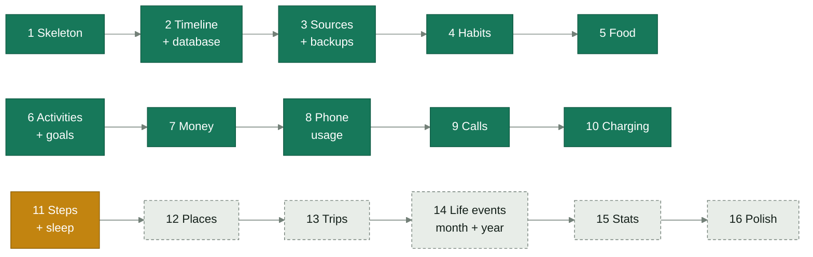
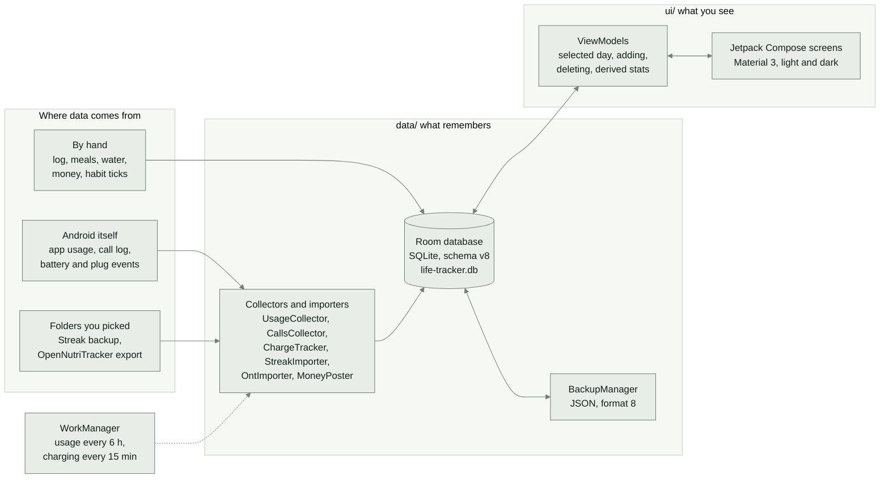
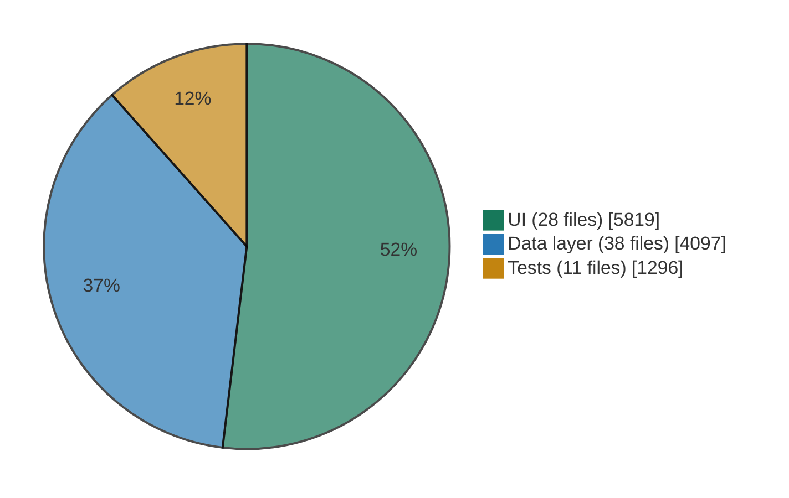
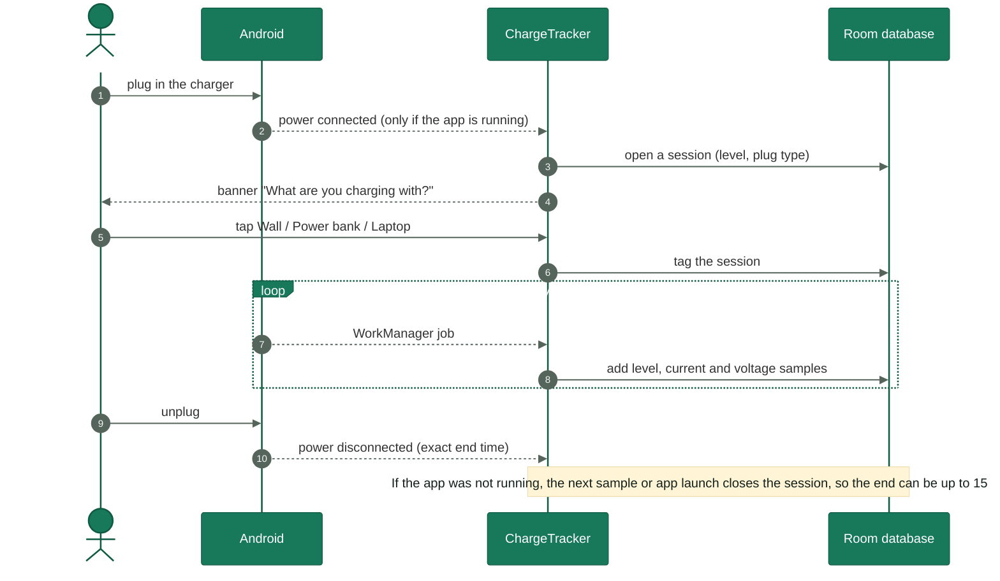
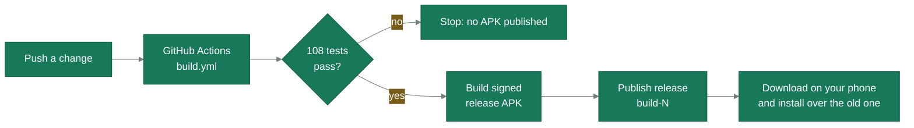

<div align="center">


<br>

[](#install)
[](app/build.gradle.kts)
[](#architecture)
[](#where-the-data-lives)
[](#tests)
[](#privacy)

<!--
  Live badges: once you know the GitHub path of this repo, replace OWNER/REPO and uncomment.
  [](https://github.com/OWNER/REPO/actions/workflows/build.yml)
  [](https://github.com/OWNER/REPO/releases/latest)
  [](https://github.com/OWNER/REPO/commits)
-->

**[Features](#features)** &nbsp;·&nbsp; **[Status](#where-the-project-stands)** &nbsp;·&nbsp; **[Roadmap](#roadmap)** &nbsp;·&nbsp; **[Install](#install)** &nbsp;·&nbsp; **[Architecture](#architecture)** &nbsp;·&nbsp; **[Privacy](#privacy)** &nbsp;·&nbsp; **[Build](#build-it-yourself)** &nbsp;·&nbsp; **[FAQ](#faq)**

</div>

<br>

Life Tracker is an Android app that replaces a pile of single-purpose trackers with one place for **what you did, what you ate, which habits you kept, where your money went, how you used your phone, and who you talked to**. It is built for exactly one person: its owner.

Everything stays on the phone. There is no account, no server, no subscription, and the manifest does not even ask for the `INTERNET` permission.

> [!NOTE]
> **Status: 10 of 16 planned steps are done.** Timeline, Food, Habits, Money, Phone usage, Calls and Charging all work. Stats is the next big screen and is still a placeholder. See [where the project stands](#where-the-project-stands).


## Features

| | Tab / screen | What it does |
| :-: | --- | --- |
| 🗓️ | **Timeline** | A day-by-day log: your own activities with start and end times, plus meals, to-dos, notes, phone-app blocks, calls and charging sessions, all on one scrollable day. Daily goals show as progress bars. |
| 🍽️ | **Food** | Calories and macros against your daily goals, meals grouped as breakfast, lunch, dinner and snack, water with one-tap buttons, and an "Eat again" row. Imports from OpenNutriTracker. |
| ✅ | **Habits** | Streaks, best streaks, totals and a tappable 14-day row per habit. Imports from Streak, including focus sessions, to-dos and notes. |
| 💸 | **Money** | Income and spending by hand, with monthly items (rent, salary, subscriptions) posted automatically and one-tap buttons for things you buy again and again. |
| 📱 | **Phone usage** | Which app was on screen and for how long, copied from Android's own history before Android forgets it, and linkable to your activities so screen-time limits become real goals. |
| 📞 | **Calls** | Who you called, when, for how long, and whether it was incoming, outgoing, missed or declined, with totals for any date range. |
| 🔌 | **Charging** | Every charging session: start, end, battery level, plug type, rough wattage, and what you charged with, learned from your own answers. |
| 💾 | **Data sources and backups** | Pick your Streak, OpenNutriTracker and backup folders once. Daily automatic backups, one-tap restore, and a safety copy before every restore. |
| 📊 | **Stats** | *Coming in Step 15.* Any metric by day, week, month or year, with a heatmap and short written insights. |

<details>
<summary><b>Timeline in detail</b></summary>

<br>

- Scroll **60 days back and 30 days ahead** with a day strip; a dot marks every day that has entries.
- Tap **Log** to record an activity (pick one of yours or tap **+ New**), a title, a start and end time and an optional note, or log a single moment with no end time.
- The day header shows tracked time, entry count and goals met, followed by one bar per activity with a daily goal. Study starts with an 8 hour goal and you can change it.
- Goals are either **at least** (8 hours of study) or **at most** (2 hours of screen time, whose bar turns red when you go over).
- Everything saved is still there after the app is closed. Tap an entry to delete it.
- **Activities** (list icon): add your own, rename, pick a colour, set a goal, or hide one from the Log pop-up without touching anything already logged.

</details>

<details>
<summary><b>Habits and Streak import in detail</b></summary>

<br>

- Each habit shows its current streak, best streak and totals, plus a 14-day row. Tap a day to tick it; counted habits add one step per tap, "relapse" habits toggle a relapse, press and hold clears the day.
- **Focus sessions** become ordinary Timeline entries at the time you focused, split at midnight when needed. Each is brought in once, and a deleted one stays deleted.
- **To-dos** with a date appear on that day of the Timeline at their time and estimated length, including future days. Tap to tick off. To-dos without a date are imported but not shown yet.
- **Notes** appear on the day they were written for.
- Streak is never modified. Importing twice never doubles anything: the higher count wins for each habit day, and a to-do you ticked stays ticked.
- Streak's weekly, monthly and "every X days" schedules are stored but not applied yet, so every habit's streak is counted as a daily one.

</details>

<details>
<summary><b>Food and OpenNutriTracker import in detail</b></summary>

<br>

- Pick a day and see calories against that day's goal, then carbs, fat and protein against theirs, and every meal under breakfast, lunch, dinner and snack.
- **Add meal** logs a new one; the **Eat again** row offers things you have eaten before.
- **Water** is tracked in the app (+250 ml, +500 ml, Undo) against a 3000 ml default target. OpenNutriTracker does not export water, so this starts at zero.
- Each meal also shows on the Timeline at the time you ate it.
- OpenNutriTracker **activities** (walking, custom ones) become Timeline entries under Health or Exercise, brought in once each.
- Amounts are grams. OpenNutriTracker counts every amount as grams even when it says "serving", and its daily totals match this app's to the calorie.

</details>

<details>
<summary><b>Money in detail</b></summary>

<br>

Adding starts with two questions: *Expense or Income?* and then *what kind?*

| Kind | For | How it behaves |
| --- | --- | --- |
| **Every month** | Rent, subscriptions, EMI, salary | Name, amount, category, day of month, start date, optional end date. Posted automatically on that day, on the last day of shorter months, and never twice. |
| **Again and again** | Chai, a bus ticket, a lassi | Saved once and shown as a button. Tap to log for today, press and hold to change the amount for that one entry. |
| **Just once** | A book, a repair, a gift | A normal one-off entry. |

You make your own spending and income categories (a starter set is included), see each month's **in, out and left**, a bar per category and every entry by day. The currency is the rupee by default (with Indian digit grouping such as ₹1,25,000) and can be changed.

</details>

<details>
<summary><b>Phone usage, Calls and Charging in detail</b></summary>

<br>

**Phone usage.** After you switch on *Usage access*, the app copies Android's record of app sessions into its own database, because Android keeps only about a week. A background job repeats the copy **every 6 hours**. The Timeline shows each stretch of app use as a block, and a *Phone usage* screen shows totals per app and lets you link an app to an activity (Anki to Study, YouTube to Screen and leisure) so its time counts toward that activity's goal. Hide apps, drop short stretches, or turn app blocks off the Timeline entirely.

**Calls.** After you allow *Call logs*, the app copies the phone's call log. Contacts access is optional and only turns numbers into names. A *Calls* screen totals any range (Today to All time, or any From and To dates, or a single day), lists the people you talk to most and shows your latest calls. Only normal phone calls appear; WhatsApp and Telegram calls are not in Android's call log.

**Charging.** The app records every time the phone is on a charger. When a session starts, a banner asks **"What are you charging with?"** with Wall, Power bank and Laptop buttons. After at least 3 similar tagged sessions (same plug type, similar speed, and at least 70% the same answer) it starts suggesting the answer itself, shown as "(guess)". Nothing runs while the phone is not charging: Android runs a small job about every 15 minutes, only while charging, so a session's end can be up to 15 minutes early when the app was not running to see the unplug.

> [!TIP]
> On Xiaomi / HyperOS, allow **Autostart**, set battery saver to **No restrictions** and allow **pop-up notifications**, or the charging banner may never appear.

Phone usage, calls and charging history only ever grow: syncing adds new rows and restoring a backup adds to what is already there, so nothing copied from the phone is deleted by the app.

</details>

<details>
<summary><b>Data sources and backups in detail</b></summary>

<br>

- Pick three folders once each: the **Streak** folder, the **OpenNutriTracker** folder and a **backup** folder such as `Documents/LifeTracker`. Android remembers the choices.
- **Back up now**, or let the app make one automatically **the first time you open it each day**. The newest 5 backups are kept, plus the newest 3 safety copies.
- **Restore** from any backup or safety copy. The file is checked before anything is touched, and your current data is saved as a safety copy first.
- Backups are plain, human-readable **JSON** files written under a temporary name and renamed only when complete, so a crash never leaves a broken backup.
- Backups include calls with numbers and names as plain text, so keep the backup folder private.

</details>


## What happens when you open it

The app does its housekeeping in a fixed, safe order, so the backup always holds the data from *before* anything new is pulled in.

```mermaid
%%{init: {'theme':'base','themeVariables':{'primaryColor':'#17785A','primaryTextColor':'#ffffff','primaryBorderColor':'#0F5A43','lineColor':'#738078','tertiaryColor':'#E8EDE8'}}}%%
flowchart LR
    A([Open the app]) --> B[1. Daily backup<br/>if none yet today]
    B --> C[2. Import newest<br/>Streak backup]
    C --> D[3. Import newest<br/>OpenNutriTracker export]
    D --> E[4. Post monthly<br/>money items now due]
    E --> F[5. Copy app usage<br/>and schedule 6-hourly sync]
    F --> G[6. Copy new<br/>calls]
    G --> H[7. Note finished<br/>charging sessions]
    classDef step fill:#17785A,stroke:#0F5A43,color:#fff;
    class B,C,D,E,F,G,H step;
```



Each step is wrapped so that one failing (a missing folder, a permission you have not granted) never stops the others.

## Where the project stands

```text
Roadmap   ██████████░░░░░░   10 of 16 steps   (62%)
Tests     108 unit tests across 11 suites
Code      ~11,200 lines of Kotlin   (5,819 UI · 4,097 data · 1,296 tests)
Schema    Room database v8, 7 migrations, 19 tables, backup format 8
Build     0.9.<run number>, signed APK on every push
```

| Area | State |
| --- | :-- |
| App skeleton, five tabs, light and dark themes, app icon | ✅ Done |
| Cloud build that publishes an installable APK | ✅ Done |
| Timeline with an on-phone database | ✅ Done |
| Data sources and backups | ✅ Done |
| Habits with Streak import | ✅ Done |
| Food with OpenNutriTracker import, water and meal logging | ✅ Done |
| Your own activities, colours and daily goals | ✅ Done |
| Money: income, spending, monthly items, quick-log items, categories | ✅ Done |
| Phone usage on the Timeline, per-app totals, app-to-activity links | ✅ Done |
| Calls on the Timeline, with totals and top people | 🧪 Built, waiting to be tried on a real phone |
| Charging sessions, plug-in banner, phone use while charging | 🧪 Built, waiting to be tried on a real phone |
| Stats | 🚧 Placeholder screen |

> [!IMPORTANT]
> Everything compiles, passes its unit tests and installs from the cloud build. The newest features (Calls, Charging) have not yet had a long run on a real phone. Treat them as fresh.

## Roadmap

Each step is small enough to build, install and try before the next begins.



<sub>🟩 done &nbsp;·&nbsp; 🟧 next &nbsp;·&nbsp; ⬜ planned. A small extra step, **9b**, added any date range to Calls and Phone usage.</sub>

### What is coming

The upcoming steps are ordered so that nothing needs an always-on notification or drains the battery: each one uses Android's own low-power services.

| Step | Name | Plan |
| :-: | --- | --- |
| **11** | **Steps and sleep** | Daily steps from Health Connect (Android 14+ records the phone's own steps), with the phone's step counter as a fallback. Sleep read from Health Connect if an app writes it, or estimated from the long night gap when the phone is not used, and always correctable. |
| 12 | Places | Name places like Home, Library or Gym, each with a radius. Android geofencing reports enter, leave and stay using Google Play services instead of running GPS. Events can arrive a few minutes late, so places are context, not a stopwatch. Includes a battery and auto-start checklist for aggressive Android skins. |
| 13 | Trips | Android activity recognition says when you start and stop walking, running, cycling or riding in a vehicle. With places, that gives trips such as "Home to Library, vehicle, 25 minutes". Unnamed stops get one location reading and a prompt to name them. You tag car, bus or train yourself. |
| 14 | Life events, month and year views | Mark moments that changed your life (a move, a new exam preparation) and look back by month or year at what you did and how much you studied around them. |
| 15 | Stats | Choose any metric, view it by day, week, month or year, with a heatmap and short written insights. Deliberately late: it needs the other steps' data to exist first. |
| 16 | Polish | Reminders, search, smoother screens and whatever daily use teaches. |

The full history of what each finished step added is in the [changelog](CHANGELOG.md).


## Privacy

> [!IMPORTANT]
> **Your data never leaves your phone.** The app declares no `INTERNET` permission, so Android itself prevents it from reaching a server.

| Principle | In practice |
| --- | --- |
| **On the phone only** | The database is a private SQLite file that no other app can read. |
| **Imports read, never write** | Your Streak and OpenNutriTracker folders are only read, never changed. |
| **Imports are repeatable** | Each import overwrites matching records instead of adding copies, so running one twice is harmless. |
| **Backups are plain files** | Ordinary JSON you can open, copy or keep, and they survive uninstalling the app. |
| **Restore is cautious** | The file is validated first and a safety copy is taken before anything changes. |
| **Phone loss is not covered** | A backup on the phone cannot help if the phone is lost. Copy the backup folder somewhere else now and then. |

<details>
<summary><b>Every permission the app asks for, and why</b></summary>

<br>

| Permission | Why | Asked how |
| --- | --- | --- |
| `PACKAGE_USAGE_STATS` | Read which app was on screen and for how long (the source Digital Wellbeing uses). | Switched on once in Android's *Usage access* settings. |
| `READ_CALL_LOG` | Copy who you called, when and for how long into the app's own database. | Prompt inside the app, only if you want Calls. |
| `READ_CONTACTS` | Turn phone numbers into names. Optional. | Prompt inside the app. |
| `QUERY_ALL_PACKAGES` | Look up the display names of the apps seen in your usage history. | Install-time, no prompt. |
| `POST_NOTIFICATIONS` | Show the "What are you charging with?" banner. | Android's normal prompt; you can say no. |

No location, no microphone, no camera, no contacts writing and no network.

To check the manifest of any build yourself:

```bash
aapt dump permissions life-tracker.apk
```

</details>

> [!WARNING]
> **Keep this repository private.** The release signing key (`keystore/lifetracker.p12`) and its password are committed **on purpose**, so every build is signed with the same key and updates install over older versions without losing data. That convenience is only safe while the repository is private. If it is ever made public, create a new key first, then back up, uninstall and reinstall the app once.

## Install

1. Open this repository's **Releases** page in your phone's browser.
2. Download `life-tracker.apk` from the newest release (`build-N`).
3. Tap the file. Android asks once to allow installs from your browser or Files app. Allow it.
4. Google Play Protect may warn that the app is from outside the Play Store. That is expected for your own app.

A new version installs over the old one and **keeps your data**.

<details>
<summary><b>First-run checklist (about two minutes)</b></summary>

<br>

- [ ] Timeline → gear icon → **Data sources** → choose a **backup folder**
- [ ] Choose the **Streak** and **OpenNutriTracker** folders if you use them, then **Import now**
- [ ] Timeline → **Activities** → set your colours and daily goals
- [ ] Allow **Usage access** if you want app time on the Timeline
- [ ] Allow **Call logs** if you want Calls
- [ ] On Xiaomi / HyperOS: Autostart on, battery saver *No restrictions*, pop-up notifications allowed

</details>

## Architecture

Three layers, and every file belongs to exactly one of them.



- **Screens** only draw things and report taps.
- **ViewModels** hold the current state and talk to the database.
- **The database** is the only place that stores anything.
- **Pure logic** (streak arithmetic, calorie sums, money totals, session splitting, the charging guess) lives in plain Kotlin objects with no Android imports, which is why it is easy to test.

**Tech stack**

| | |
| --- | --- |
| Language | Kotlin 2.0.21 |
| UI | Jetpack Compose, Material 3 (BOM 2024.12.01) |
| Storage | Room 2.6.1 on SQLite, via KSP |
| Background | WorkManager 2.9.1 |
| Folder access | AndroidX DocumentFile (Storage Access Framework) |
| Build | Gradle 8.10.2, Android Gradle Plugin 8.7.3, JDK 17 |
| SDK | min 26 (Android 8.0), target and compile 35 |
| CI | GitHub Actions |

**Where the lines are**



### Where the data lives

One database, 19 tables, grouped by what they remember:

| Area | Entities |
| --- | --- |
| Timeline | `EntryEntity`, `ActivityTypeEntity` |
| Habits and plans (Streak) | `HabitEntity`, `CompletionEntity`, `CategoryEntity`, `TodoEntity`, `TodoTagEntity`, `NoteEntity`, `ImportedItemEntity` |
| Food | `MealEntity`, `FoodGoalEntity`, `WaterEntity` |
| Money | `MoneyCategoryEntity`, `MoneyItemEntity`, `MoneyEntryEntity` |
| Phone usage | `UsageSessionEntity`, `UsageAppEntity` |
| Calls | `CallEntity` |
| Charging | `ChargeSessionEntity` |

> [!NOTE]
> **No data is ever lost by an update.** Every change to the database structure ships with a proper migration (seven so far, 1 to 8). Wiping and rebuilding the database is never allowed, and `fallbackToDestructiveMigration` is deliberately never used.

### A charging session, end to end

The most intricate feature, because Android only tells a running app about plug and unplug, so the app combines three sources of truth.



<details>
<summary><b>Full file tree</b></summary>

<br>

```text
Life-Tracker/
├── README.md · CHANGELOG.md
├── docs/assets/                      Banner, divider and social preview graphics
├── settings.gradle.kts               Names the project and its one module
├── build.gradle.kts                  Versions of the build plugins
├── gradle.properties                 Build settings
├── keystore/lifetracker.p12          Fixed signing key, so updates keep your data
├── .github/workflows/build.yml       Every push becomes a tested, signed APK
│
└── app/
    ├── build.gradle.kts              App settings, version number, libraries
    ├── proguard-rules.pro
    └── src/
        ├── test/…/data/              11 suites, 108 tests (see Tests)
        └── main/
            ├── AndroidManifest.xml
            ├── res/                  Icons, adaptive launcher icon, light and dark themes
            └── java/com/lifetracker/app/
                ├── MainActivity.kt            Entry point: theme + app
                ├── LifeTrackerApplication.kt  Listens for plug/unplug while the app runs
                │
                ├── data/                      ── what remembers ──
                │   ├── Database.kt            Timeline entries, the database, all migrations
                │   ├── Tables.kt              Habits, completions, to-dos, notes, import records
                │   ├── ActivityTypes.kt       Your activities (names, colours, goals)
                │   ├── ActivityStats.kt       Time per activity, goal progress
                │   ├── HabitStats.kt          Streak arithmetic
                │   ├── FoodTables.kt · FoodStats.kt
                │   ├── MoneyTables.kt · MoneyStats.kt · MoneyPoster.kt · MoneySettings.kt
                │   ├── UsageTables.kt · UsageSessions.kt · UsageCollector.kt
                │   ├── UsageSyncWorker.kt · UsageSettings.kt
                │   ├── CallTables.kt · CallStats.kt · CallsCollector.kt · CallsSettings.kt
                │   ├── ChargeTables.kt · ChargeStats.kt · ChargeTracker.kt
                │   ├── ChargeNotifier.kt · ChargeWorker.kt · ChargeSettings.kt
                │   ├── DateSpan.kt            Whole-day ranges and quick choices
                │   ├── Backup.kt              Backup file format (JSON) and reading it back
                │   ├── BackupManager.kt       Write, list, restore, daily auto backup
                │   ├── DataSources.kt         The three chosen folders, remembered
                │   ├── SourceScanner.kt       Finds the newest Streak / OpenNutriTracker file
                │   ├── streak/                Models, parser, focus converter, importer
                │   └── ont/                   Parser, converter, importer
                │
                └── ui/                        ── what you see ──
                    ├── LifeTrackerApp.kt      Bottom tab bar, startup housekeeping
                    ├── Timeline*.kt · LogSheet.kt
                    ├── Habits*.kt · Food*.kt · AddMealSheet.kt
                    ├── Money*.kt              Screen, view model, add-flow dialogs
                    ├── PhoneUsage*.kt · Calls*.kt · Charging*.kt
                    ├── Activities*.kt · ActivityEditor.kt
                    ├── DataSources*.kt · RangePicker.kt
                    ├── Model.kt · Format.kt · Components.kt
                    └── theme/Theme.kt         Light and dark colours
```

</details>

## Tests

108 unit tests run on every push, **before** the APK is built. If one fails, no APK is published. The logic they cover is deliberately free of Android classes so it can run in the cloud.

| Suite | Tests | What it protects |
| --- | :-: | --- |
| `MoneyStatsTest` | 16 | Totals, Indian and Western digit grouping, monthly-item rules |
| `ChargeStatsTest` | 16 | Charging arithmetic, session rules, the learned "what you charged with" guess |
| `UsageSessionsTest` | 14 | Turning Android's app events into sessions, and a day's blocks and totals |
| `BackupCodecTest` | 11 | A backup reads back exactly as it was written |
| `HabitStatsTest` | 9 | Streak and clean-day arithmetic |
| `StreakImportTest` | 8 | Streak backup parsing and splitting focus sessions at midnight |
| `ActivityStatsTest` | 8 | Time per activity and goal arithmetic |
| `DateSpanTest` | 8 | Whole-day ranges and the quick date choices |
| `CallStatsTest` | 7 | Call wording, totals and top people |
| `OntImportTest` | 6 | OpenNutriTracker export parsing |
| `FoodStatsTest` | 5 | Calorie, macro and goal arithmetic |

## Build it yourself

You do not need a computer to get builds (see below), but you can build locally.

**Requirements:** JDK 17, the Android SDK (platform 35) with `ANDROID_HOME` set, and Gradle 8.10.2. The repository does not include a Gradle wrapper, so install Gradle or generate one with `gradle wrapper --gradle-version 8.10.2`.

```bash
# run the tests, then build the signed release APK
gradle testReleaseUnitTest assembleRelease -PversionCodeOverride=1

# the result
ls app/build/outputs/apk/release/app-release.apk
```

### How a new version gets built in the cloud



The GitHub run number becomes the app's internal version code (and the last part of its version name, `0.9.N`), so every build counts as newer than the last and installs cleanly over it.

## Rules the project lives by

1. **Your data stays on your phone.** No accounts, no servers, no tracking.
2. **No data is ever lost by an update.** Every database change ships with a migration.
3. **Small steps you can try.** Each roadmap step ends with something you can install and use.
4. **Plain and quiet.** No notifications, ads or nagging unless you ask for them.
5. **Built when you say so.** Work on a step begins only when the owner asks for it.

## FAQ

<details>
<summary><b>Is this on the Play Store?</b></summary>

<br>

No. It is a personal app installed from the GitHub Releases page. Play Protect will warn that it is from outside the Play Store; that is expected. (It also uses `QUERY_ALL_PACKAGES` and call-log access, which the Play Store restricts heavily.)

</details>

<details>
<summary><b>Do I need Streak or OpenNutriTracker?</b></summary>

<br>

No. They are optional import sources. Without them, Habits and Food still work from what you enter by hand, and everything else is independent of them.

</details>

<details>
<summary><b>Will importing change or duplicate my Streak or OpenNutriTracker data?</b></summary>

<br>

It never changes their files, and importing the same export twice is harmless: matching records are overwritten, not added again, the higher count wins for each habit day, and anything you deleted from the Timeline stays deleted.

</details>

<details>
<summary><b>Why does Android only show about a week of app usage, but Life Tracker shows more?</b></summary>

<br>

Android keeps only a short window of detailed usage events. The app copies them into its own database on open and every 6 hours, so history accumulates from the moment you switch on Usage access. It cannot recover days from before that, which is why the date picker only offers days it has already copied.

</details>

<details>
<summary><b>Why is the charge source sometimes only a guess?</b></summary>

<br>

Android cannot tell a power bank from a wall charger on its own. The app asks once per session, then learns from your answers and only suggests a guess after at least 3 similar sessions where you gave the same answer at least 70% of the time.

</details>

<details>
<summary><b>Can I move to a new phone?</b></summary>

<br>

Yes. Copy the backup folder to the new phone, install the app, pick the folder in **Data sources** and **Restore**. Streak and OpenNutriTracker data can be re-imported from their own exports.

</details>

## Credits

Life Tracker is a personal project that learns from four apps it replaces or complements. It is not affiliated with any of them.

| App | What this project learned from it |
| --- | --- |
| [OpenNutriTracker](https://github.com/simonoppowa/OpenNutriTracker) | The Food tab and its importer |
| Streak | The Habits tab, its importer, and how backups are written safely (temporary name, then rename) |
| LifeXP | A hand-logged timeline with your own activities |
| Simkl | Deep, customisable statistics, coming in the Stats tab |

<br>

<div align="center">


<sub>Built one small step at a time &nbsp;·&nbsp; every byte stays on your phone</sub>

<sub>[Back to top ↑](#)</sub>

</div>

<!--
  SCREENSHOTS: this README has no phone screenshots yet because none were available when it was written.
  Take one of each tab (Timeline, Food, Habits, Money, Calls, Charging), save them in docs/screenshots/
  and paste the block below near the top, right after the intro paragraphs.

  <div align="center">
  
  
  
  
  
  </div>

  Also: upload docs/assets/social-preview.png under Settings → General → Social preview.
-->
